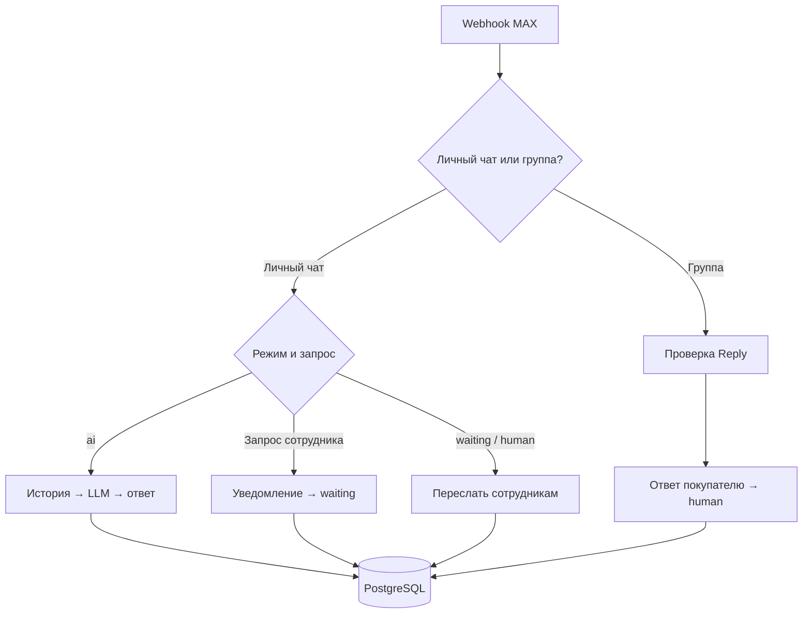

# Барьер — AI-помощник в MAX

**Проект для реального заказчика — магазина дверей «Барьер» на Камчатке.**

ИИ-помощник консультирует покупателей по вопросам дверей и услуг магазина, учитывает историю разговора и передаёт обращение сотруднику. Покупатель продолжает общаться в том же личном чате MAX.

**Стадия:** основная функциональность реализована; проект подготовлен к тестированию заказчиком. Эффект на продажи и время работы сотрудников пока не измерен.

## Задача бизнеса

Покупателям нужны ответы о выборе дверей, примерной стоимости, доставке, установке и порядке обращения в магазин. Сотрудник должен получать контекст вопроса, когда покупателю нужна персональная помощь.

Решение объединяет автоматическую консультацию и участие сотрудника. ИИ отвечает по сведениям магазина; подбор конкретной модели, наличие, окончательная цена и согласование выезда требуют подтверждения человеком.

## Что реализовано

- Приём сообщений MAX через защищённый webhook и отправка ответов через HTTP API.
- Консультация с OpenAI по правилам и сведениям, согласованным с заказчиком.
- История переписки в PostgreSQL: последние 30 сообщений передаются модели в хронологическом порядке.
- Режимы диалога `ai`, `waiting`, `human`, сохранённые в базе данных.
- Передача обращения в группу «Барьер — обращения»: текст запроса, ID чата покупателя и до 12 предыдущих сообщений; текст истории ограничен 2 500 символами.
- Пересылка новых сообщений покупателя сотрудникам в режимах ожидания и общения с человеком.
- Ответ сотрудника покупателю через Reply в группе. Проверяются группа, отправитель-человек, тип Reply, текст, ID покупателя и автор исходного сообщения — бот.
- Возврат к автоматической консультации по фразе «Вернуться к ИИ».
- Параметризованные SQL-запросы и нормализация текста ответа на JavaScript.

## Моя роль

Собрал требования и уточнил условия консультаций с заказчиком, разработал workflow в n8n, подключил LLM и PostgreSQL, реализовал передачу диалога сотрудникам и адаптировал первоначальный Telegram-сценарий под MAX. Подготовил инструкцию сотрудникам и проверил основные сценарии в рабочей среде перед передачей заказчику.

В этом репозитории опубликована версия MAX. Telegram был первым этапом разработки, его workflow в комплект не входит.

## Архитектура

## Режимы диалога

| Режим | Поведение |
| --- | --- |
| `ai` | ИИ консультирует покупателя. Запрос сотрудника направляет обращение в группу. |
| `waiting` | ИИ не отвечает; сообщения покупателя пересылаются сотрудникам. |
| `human` | Диалог ведёт сотрудник; ответы направляются из группы в личный чат. |

Команда «Вернуться к ИИ» переводит любой текущий режим в `ai`. Ответы сотрудника сохраняются с пометкой «Сотрудник магазина» в роли `assistant`. Поздний ответ сотрудника отправляется покупателю; SQL обновления режима сохраняет `ai`, если покупатель уже вернулся к ИИ. Полной защиты от одновременных событий эта проверка не обеспечивает.

## Стек

**n8n · MAX HTTP API · OpenAI · PostgreSQL · JavaScript · Docker / Ubuntu VPS**

Модель и адрес API сохранены как в предоставленном экспорте. Доступность модели и совместимость нод следует проверить в собственной среде перед запуском.

## Файлы

| Путь | Содержимое |
| --- | --- |
| `workflow/barrier-max.public.json` | Очищенный workflow для импорта и изучения. |
| `sql/schema.sql` | Минимальная совместимая схема PostgreSQL, восстановленная по SQL-запросам workflow; это не дамп рабочей базы. |
| `docs/setup.md` | Подключение credentials, группы, бота и базы. |
| `docs/manual-checks.md` | Сценарии ручной проверки после настройки. |

## Запуск

1. Создать тестовую базу и выполнить `sql/schema.sql`.
2. Импортировать `workflow/barrier-max.public.json` в n8n.
3. Подключить собственные credentials MAX, webhook, PostgreSQL и OpenAI.
4. Заменить `STAFF_CHAT_ID` и `BOT_USER_ID`, проверить настройки модели и сведения в промпте.
5. Настроить webhook MAX на свой HTTPS-адрес и провести проверки из `docs/manual-checks.md`.

Подробности: [docs/setup.md](docs/setup.md).

## Границы текущей версии

- Актуальные остатки и каталог из 1С не подключены. Бот не подтверждает наличие товара.
- Оплата и оформление покупки в чате не реализованы. Согласование замера или установки выполняет сотрудник.
- Напоминания, отслеживание статусов заказа и метрики бизнеса — возможные следующие этапы, а не функции опубликованной версии.
- В данном экспорте нет отдельной дедупликации webhook-событий, глобального workflow обработки ошибок или гарантированной очереди доставки. Повторные и одновременные события требуют дополнительной проверки и доработки перед масштабированием.

## Публичная копия

Из экспорта удалены ссылки на credentials, внутренние ID, метаданные экземпляра n8n, диагностическая ветка и нода очистки тестового чата. Workflow не активирован. Рабочие данные и переписка клиентов в комплект не включены.

Промпт отражает правила магазина на момент экспорта. Он служит примером проектной логики; цены и условия требуется актуализировать перед использованием.

Проверены корректность JSON, целостность связей и отсутствие выявленных секретов в публичной копии. Запуск очищенного workflow с новыми credentials в отдельной среде не выполнялся.

Автор: [Александр Зайцев](https://github.com/AlexZaytsev-ai).
