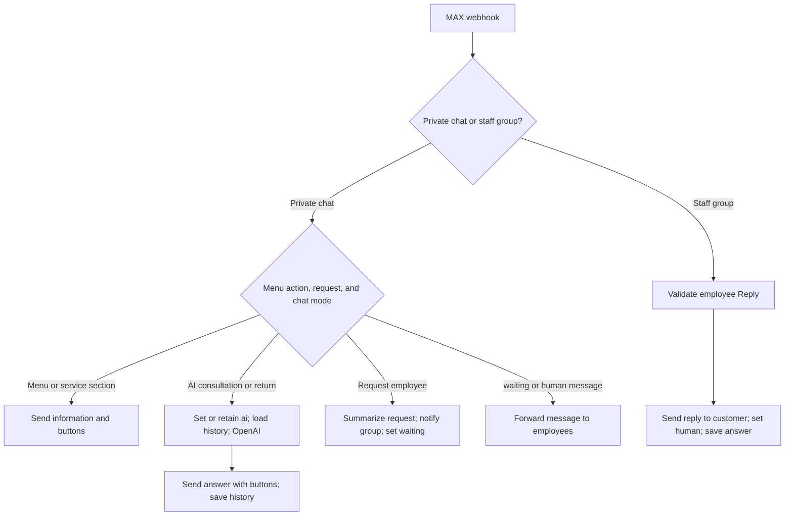

# Barrier MAX AI Assistant

[Русская версия](README_RU.md)

**A project built for a real customer — Barrier, a door retailer in Kamchatka, Russia.**

A customer assistant built with n8n: a six-button MAX menu, AI consultation, service information, and employee handoff in the same private chat. OpenAI uses conversation history from PostgreSQL; employees receive a concise request summary and reply from a staff group.

**Project status — 8 October 2026:** the current implementation stage is complete, the deployed menu and handoff scenarios have been manually checked, and the updated version has been handed over for customer feedback. Business impact has not yet been measured.

**Repository scope:** this README describes the current deployed version. The JSON export and workflow screenshot are an earlier baseline, before the six-button menu, request summaries, and error notifications. Importing that export does not reproduce all features described below.

---

## Business Problem

Customers ask about door selection, indicative prices, delivery, installation, measurements, and visiting the store. Employees may be busy when a message arrives and need the customer's requirements when taking over.

The assistant provides service information through buttons, supports open-ended AI consultation, and transfers requests to an employee with a concise summary. Product availability, final prices, and appointment confirmation remain under human control.

---

## My Role

Gathered requirements with the customer, configured consultation rules, built the n8n workflow, integrated OpenAI and PostgreSQL, implemented employee handoff, and adapted the initial Telegram workflow to MAX.

After feedback requesting a more structured interface, added the six-button menu and information sections, shortened labels after phone testing, and replaced lengthy handoff history with a concise summary. Configured retries and private error notifications, updated the store website and bot entry points, prepared employee instructions, and checked the main interaction scenarios.

The public export contains the earlier MAX baseline. Telegram was the initial development stage and is not included.

---

## Customer Menu

The menu uses three rows of two buttons. Russian labels match the deployed interface.

| Button | Action |
| --- | --- |
| 🤖 Спросить ИИ | Starts or resumes AI consultation with the existing conversation history. |
| 👤 Сотрудник | Sends the request and a concise summary to the employee group. |
| 🚚 Доставка | Shows delivery terms and how to contact an employee for confirmation. |
| 📍 Адреса и часы | Shows store addresses, opening hours, contact details, and the website. |
| 📏 Замер | Shows measurement service terms and how to arrange a visit. |
| 🛠️ Установка | Shows installation terms and explains which details require confirmation. |

Pressing **Start** triggers a greeting and the menu. Existing users can send **Меню** (Menu). AI answers and information sections include **Сотрудник** and **Меню** buttons; the handoff confirmation offers **Спросить ИИ** and **Меню**.

Information sections and the menu are available while waiting for an employee or during a human conversation without changing the chat mode. **Спросить ИИ** explicitly switches the conversation back to AI.

---

## Current Workflow Architecture

Chat modes and message history are stored in PostgreSQL. Explicit workflow conditions handle menu routing, handoff, and Reply validation; the language model handles consultation and request summaries.

### Baseline Workflow Screenshot

This image corresponds to the earlier public export, not the current menu-based version.

---

## How It Works

1. MAX sends message events or a bot-start event to the authenticated n8n webhook.
2. A bot-start event returns the greeting and menu. Message events are routed separately for private chats and the employee group.
3. Button labels are normalized and routed to explicit menu branches before the chat-mode check. Service sections return prepared text without a model call.
4. For AI consultation, a bounded recent history is loaded from PostgreSQL in chronological order. OpenAI answers using that context and the store's consultation rules.
5. n8n prepares the response, sends it with navigation buttons, and saves the conversation.
6. When a customer asks for an employee, a separate model call summarizes the request, preferences, latest budget, and questions that need confirmation. Store addresses, contact details, and repeated boilerplate are excluded.
7. The employee group receives the summary and customer chat ID. The conversation switches to `waiting` and the customer receives a handoff confirmation.
8. In `waiting` and `human` modes, ordinary customer messages are forwarded to the group; the consultation AI does not answer them.
9. An employee uses **Reply** on the relevant bot-generated request or forwarded message. After validation, the answer is delivered to that customer's private chat and saved with an employee label.
10. The customer can select **Спросить ИИ** to switch to `ai` without deleting the conversation history.

---

## Chat Modes

| Mode | Behavior |
| --- | --- |
| `ai` | AI consultation; a request for human assistance triggers handoff. |
| `waiting` | Waiting for an employee; ordinary messages are forwarded to the group. |
| `human` | An employee handles the conversation through the staff group. |

Opening the menu or a service section does not change the mode. Returning to AI preserves history. Simultaneous events and late employee replies remain separate verification cases; no event-ordering guarantee is claimed.

---

## Error Handling

In the configured environment, the customer-response HTTP node uses **Retry On Fail** with up to **three total attempts**, separated by **5-second waits**. This is a node-level setting, not a guarantee that every API call is retried or that a retry will succeed.

If the main workflow ends in an error, a separate **Error Trigger** workflow sends the maintainer a private MAX alert containing the workflow name, failed node, error message, and execution link.

The error route was checked using a separate production webhook workflow calling `https://httpbin.org/status/429`. After unsuccessful attempts, the alert arrived automatically with the expected details. The handler applies to workflow failures generally; the test deliberately used HTTP 429.

---

## Website and Bot Entry Points

- Updated the store website, including mobile layout, service information, and the measurement page wording.
- Added links to the MAX bot on the website; prepared QR codes and handed them over for printing.
- Added the store website to the bot's address section.

Store website: [barierpk41.ru](https://barierpk41.ru/). MAX bot: [Barrier assistant](https://max.ru/id410500134909_bot).

Website editing was part of the customer delivery. The website source is not included in this repository.

---

## Key Architecture Decisions

* Prepared menu sections answer routine service questions; OpenAI handles open-ended consultation.
* Routing and chat modes are controlled by explicit conditions.
* PostgreSQL stores the mode separately from the AI conversation context.
* Session keys use `max:<chat_id>` to associate messages with a conversation.
* History and summary lengths are bounded before being sent to the model or employee group.
* An employee reply must come from the configured group, from a human sender, and use Reply on a message originally sent by the bot.
* Customer chat ID and reply text are checked before sending the answer.
* Database queries use parameters rather than concatenating customer input into SQL.
* Availability, final prices, and appointments require an employee. There is no live stock or 1C integration in the current implementation.

---

## Tech Stack

| Technology | Purpose |
| --- | --- |
| n8n | Workflow automation, menu routing, handoff, and error handling |
| MAX HTTP API | Message events, inline buttons, customer responses, and employee communication |
| OpenAI API | Consultation and concise request summaries |
| PostgreSQL | Conversation history and persistent chat modes |
| JavaScript | Button-label normalization, response preparation, and expressions |
| Docker / Ubuntu VPS | Deployment environment |

---

## Import and Setup

The public export is the earlier baseline. It excludes credentials, internal employee group and bot IDs, pinned chat data, and instance metadata. The workflow is inactive and requires configuration. The latest menu, summaries, and separate error workflow are not included.

1. Create a test database and run `sql/schema.sql`. This is a minimal compatible schema reconstructed from baseline workflow queries, not a production database dump.
2. Import `workflow/barrier-max.public.json` into n8n.
3. Configure MAX, webhook authentication, PostgreSQL, and OpenAI credentials.
4. Replace `STAFF_CHAT_ID` and `BOT_USER_ID` in the nodes listed in [docs/setup.md](docs/setup.md).
5. Check model availability, API connectivity, and the store information in the system prompt. Business terms in the older export must be reviewed before use.
6. Register the MAX subscription with your HTTPS webhook URL and matching authentication settings.
7. Check the baseline consultation, handoff, employee Reply, and return-to-AI scenarios before activation.

Setup details: [docs/setup.md](docs/setup.md). Baseline and current-version verification plans: [docs/manual-checks.md](docs/manual-checks.md).

---

## Verified Scenarios and Current Result

Manual checks in the configured environment covered:

* AI consultation with conversation context.
* Opening the menu and all four information sections.
* Greeting and menu after a bot-start event.
* Full visibility of shortened button labels on a phone.
* An employee summary using the latest stated budget and requirements, without repeated store contact information.
* Request handoff and forwarding customer messages while AI consultation is paused.
* Delivering an employee Reply to the correct private chat.
* Returning from human mode to AI without deleting history.
* Consultation checks for store prices, service terms, and unrelated requests.
* Automatic private error notification with a workflow name, node, error, and execution link after the HTTP 429 test.

**Result:** the deployed assistant combines structured service navigation, open-ended AI consultation, and employee handoff. The current implementation stage is complete; customer feedback on usability, service wording, and summary usefulness is pending. Sales conversion, response-time improvements, and workload reduction have not been measured.

The sanitized baseline export passed JSON and connection checks when prepared. It has not been executed with new credentials in a separate environment.

---

## Author

Alexander Zaytsev

AI Automation Engineer

* GitHub: https://github.com/AlexZaytsev-ai
* Email: [zaytcev_alexandr@mail.ru](mailto:zaytcev_alexandr@mail.ru)
