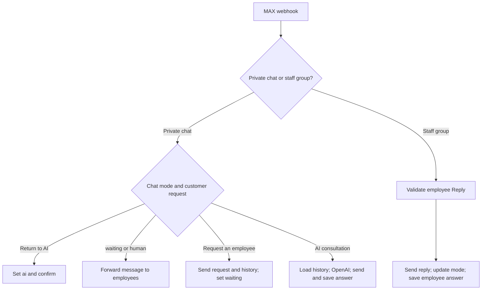

# Barrier MAX AI Assistant

[Русская версия](README_RU.md)

**A project built for a real customer — Barrier, a door retailer in Kamchatka, Russia.**

AI-assisted customer consultation workflow built with n8n. It receives messages in MAX, uses OpenAI with conversation history from PostgreSQL, and transfers requests to store employees. Employees reply from a staff group; the customer receives their responses in the same private chat.

**Project status:** core functionality implemented and prepared for customer testing. Business impact has not yet been measured.

---

## Business Problem

Customers ask about door selection, indicative prices, delivery, installation, measurements, and visiting the store. Employees may be busy or unavailable when a message arrives and need conversation context when taking over.

The workflow provides initial guidance based on information supplied by the customer company and passes requests to employees with recent conversation history. Product availability, final prices, and appointment confirmation remain under human control.

---

## My Role

Gathered requirements with the customer, configured consultation rules, built the n8n workflow, integrated OpenAI and PostgreSQL, implemented employee handoff, and adapted the initial Telegram workflow to MAX. Prepared operating instructions for employees and checked the main interaction scenarios before customer testing.

This repository contains the MAX version. Telegram was the initial development stage and is not included in the public export.

---

## Workflow Architecture

Chat modes and message history are stored in PostgreSQL. Routing, handoff, and Reply validation are handled by explicit workflow conditions rather than by the language model.

---

## Workflow

---

## How It Works

1. MAX sends a message event to the authenticated n8n webhook.
2. The workflow checks the event type and routes private messages separately from staff group messages.
3. For a private message, n8n prepares the text and chat ID and loads the current mode from PostgreSQL.
4. In AI mode, up to 30 previous messages are loaded in chronological order. OpenAI answers using this history and the store's consultation rules.
5. JavaScript normalizes the response and adds store location details for relevant visit requests. n8n sends the answer and saves the user/assistant pair.
6. A request for an employee, measurement, or installation arrangement is sent to the staff group; the chat switches to `waiting`.
7. The handoff includes the current request, customer chat ID, and up to 12 previous messages; the history text is limited to 2,500 characters.
8. In `waiting` and `human` modes, new customer messages are forwarded to the group; the AI does not answer them.
9. An employee uses Reply on a bot-generated request or forwarded message. After validation, the answer is sent to the customer and saved with an employee label.
10. The customer returns to AI consultation by sending «Вернуться к ИИ» (Return to AI).

---

## Chat Modes

| Mode | Behavior |
| --- | --- |
| `ai` | AI consultation; a request for human assistance triggers handoff. |
| `waiting` | Waiting for an employee; new messages are forwarded to the group. |
| `human` | An employee handles the conversation through the staff group. |

The return-to-AI command sets `ai`. A late employee reply is still delivered; the mode update preserves `ai` if the customer has already returned to the assistant. This check does not guarantee ordering of simultaneous events.

---

## Key Architecture Decisions

* OpenAI handles consultation; explicit conditions handle routing and modes.
* PostgreSQL stores the mode independently of AI conversation context.
* Session keys use `max:<chat_id>` to associate messages with a conversation.
* History is bounded before being sent to the model or staff group.
* An employee reply must come from the configured group, from a human sender, and use Reply on a message originally sent by the bot.
* Customer chat ID and reply text are checked before sending the answer.
* Database queries use parameters rather than concatenating customer input into SQL.
* Availability, final prices, and appointments require an employee. The assistant has no access to current stock or the full 1C catalog.

---

## Tech Stack

| Technology | Purpose |
| --- | --- |
| n8n | Workflow automation, routing, and integration |
| MAX HTTP API | Message intake, customer responses, and staff group communication |
| OpenAI API | Consultation using store rules and conversation history |
| PostgreSQL | Message history and persistent chat modes |
| JavaScript | Response normalization and expression logic |
| Docker / Ubuntu VPS | Deployment environment |

---

## Import and Setup

The public export excludes credentials, internal staff group and bot IDs, pinned chat data, and instance metadata. The workflow is inactive and requires configuration.

1. Create a test database and run `sql/schema.sql`. This is a minimal compatible schema reconstructed from workflow queries, not a production database dump.
2. Import `workflow/barrier-max.public.json` into n8n.
3. Configure MAX, webhook authentication, PostgreSQL, and OpenAI credentials.
4. Replace `STAFF_CHAT_ID` and `BOT_USER_ID` in the nodes listed in [docs/setup.md](docs/setup.md).
5. Check model availability, API connectivity, and the store information in the system prompt.
6. Register the MAX subscription with your HTTPS webhook URL and matching authentication settings.
7. Check consultation, handoff, employee Reply, and return-to-AI scenarios before activation for customer use.

Setup details: [docs/setup.md](docs/setup.md). Manual verification plan: [docs/manual-checks.md](docs/manual-checks.md).

---

## Tested Scenarios

The main scenarios were checked in the original configured environment before handoff to the customer:

* Consultation using context from previous messages.
* Requesting an employee and notifying the staff group.
* Forwarding new customer messages while AI consultation is paused.
* Delivering an employee Reply to the correct private chat.
* Returning the chat to AI mode.
* Consultation checks for store prices, service terms, and unrelated requests.

The sanitized export has passed JSON and connection checks. It has not been executed with new credentials in a separate environment.

---

## Author

Alexander Zaytsev

AI Automation Engineer

* GitHub: https://github.com/AlexZaytsev-ai
* Email: [zaytcev_alexandr@mail.ru](mailto:zaytcev_alexandr@mail.ru)
