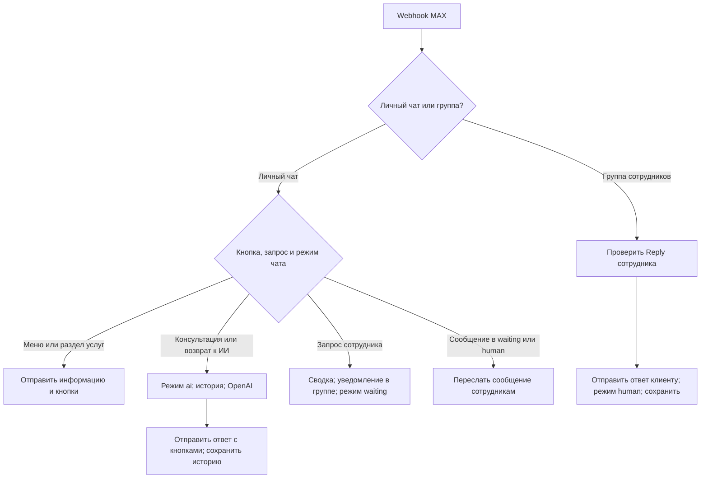
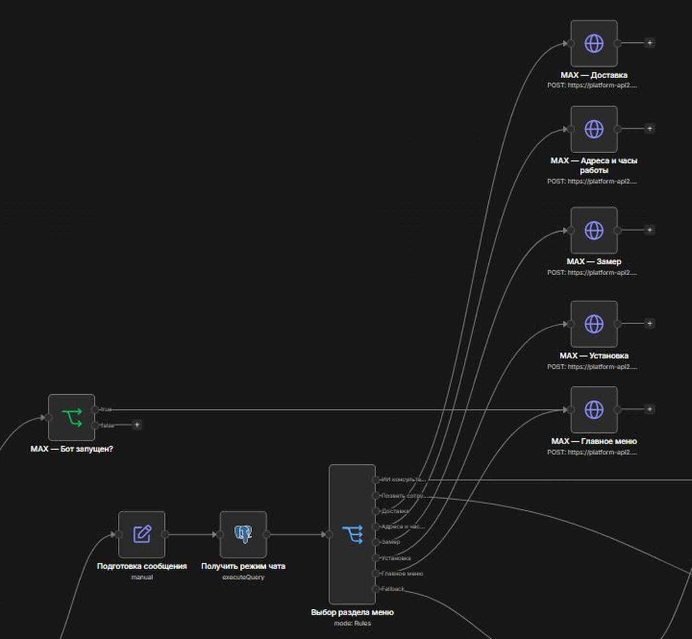
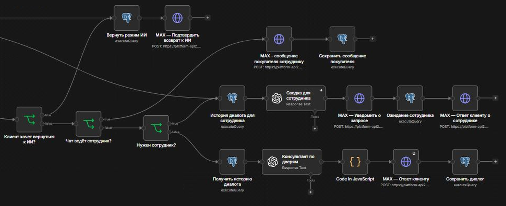
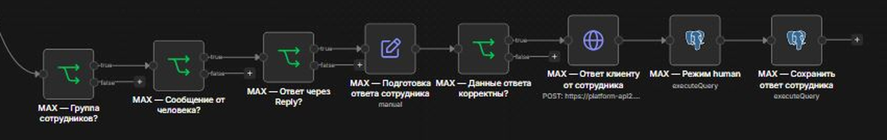

# Barrier MAX AI Assistant

[English version](README.md)

**Проект для реального заказчика — магазина дверей «Барьер» на Камчатке.**

Помощник покупателей на n8n: меню из шести кнопок в MAX, консультация ИИ, информация об услугах и передача диалога сотруднику в том же личном чате. OpenAI использует историю из PostgreSQL, а продавец получает краткую сводку обращения и отвечает из рабочей группы.

**Статус на 8 октября 2026 года:** текущий этап доработки завершён, меню и передача диалога проверены вручную в рабочей среде, обновлённая версия передана на тестирование заказчику. Влияние на продажи и время работы сотрудников пока не измерено.

**Состав репозитория:** README и скриншоты показывают актуальную рабочую версию. JSON относится к более раннему этапу — до меню из шести кнопок, сводки обращения и уведомлений об ошибках. Импорт этого JSON не воспроизводит все описанные ниже возможности.

---

## Бизнес-задача

Покупатели спрашивают о выборе дверей, примерной стоимости, доставке, установке, замерах и визите в магазин. Сотрудники могут быть заняты в момент обращения, а для подключения к разговору им нужны пожелания покупателя.

Помощник показывает информацию об услугах через кнопки, консультирует в свободном диалоге и передаёт сотруднику обращение с краткой сводкой. Наличие товара, окончательная цена и подтверждение даты выезда остаются за человеком.

---

## Моя роль

Собрал требования с заказчиком, настроил правила консультации, разработал workflow в n8n, подключил OpenAI и PostgreSQL, реализовал передачу диалога сотрудникам и адаптировал первоначальный Telegram-сценарий под MAX.

По пожеланию заказчика добавил меню из шести кнопок и информационные разделы. После проверки на телефоне сократил подписи кнопок, заменил длинную историю при передаче обращения краткой сводкой. Настроил повторные попытки и личные уведомления об ошибках, обновил сайт магазина и точки входа в бота, подготовил инструкцию сотрудникам и проверил основные сценарии.

Публичный экспорт содержит раннюю базовую версию MAX. Telegram был первым этапом разработки и в экспорт не входит.

---

## Меню покупателя

Три ряда по две кнопки. Подписи соответствуют опубликованному интерфейсу.

| Кнопка | Действие |
| --- | --- |
| 🤖 Спросить ИИ | Включить или возобновить консультацию с сохранённой историей диалога. |
| 👤 Сотрудник | Передать обращение и краткую сводку в рабочую группу продавцов. |
| 🚚 Доставка | Посмотреть условия доставки и порядок согласования с сотрудником. |
| 📍 Адреса и часы | Посмотреть адреса, часы работы, телефоны и сайт магазина. |
| 📏 Замер | Посмотреть условия замера и порядок согласования выезда. |
| 🛠️ Установка | Посмотреть условия установки и сведения, которые нужно подтвердить. |

После **«Начать»** бот отправляет приветствие и меню. Для уже существующего диалога можно отправить **«Меню»**. Под ответами ИИ и информационными разделами есть кнопки **«Сотрудник»** и **«Меню»**; в подтверждении передачи обращения — **«Спросить ИИ»** и **«Меню»**.

Меню и информационные разделы доступны при ожидании сотрудника и во время общения с ним без изменения режима. Кнопка **«Спросить ИИ»** явно возвращает диалог к ИИ.

---

## Архитектура рабочей версии

Режимы чатов и история сообщений хранятся в PostgreSQL. Условия workflow управляют меню, передачей обращения и проверкой Reply; языковая модель консультирует покупателя и составляет сводку.

### Скриншот актуального workflow

Основной workflow на 8 октября 2026 года. Нажмите на изображение, чтобы открыть его в полном размере; для чтения подписей нод раскройте увеличенные фрагменты ниже.

Меню и информация об услугах

Консультация ИИ и передача сотруднику

Ответы сотрудника

---

## Как это работает

1. MAX отправляет событие сообщения или запуска бота в webhook n8n с проверкой авторизации.
2. При запуске бот показывает приветствие и меню. Сообщения личного чата и группы сотрудников обрабатываются отдельно.
3. Подписи кнопок нормализуются и попадают в явные ветки меню до проверки режима чата. Информационные разделы отправляют подготовленный текст без обращения к модели.
4. Для консультации ИИ загружается ограниченная выборка последних сообщений из PostgreSQL в хронологическом порядке. OpenAI отвечает с учётом контекста и правил магазина.
5. n8n подготавливает ответ, отправляет его с кнопками навигации и сохраняет переписку.
6. При запросе сотрудника отдельный вызов модели собирает сводку: суть обращения, пожелания, последний бюджет и вопросы для подтверждения. Адреса магазинов, контакты и повторяющиеся справочные блоки исключаются.
7. В группу продавцов приходят сводка и ID чата покупателя. Режим меняется на `waiting`, покупатель получает подтверждение передачи.
8. В режимах `waiting` и `human` обычные сообщения покупателя пересылаются в группу; ИИ-консультант на них не отвечает.
9. Продавец нажимает **«Ответить / Reply»** на нужное обращение или пересланное сообщение бота. После проверки ответ приходит в личный чат этого покупателя и сохраняется с пометкой сотрудника.
10. Кнопка **«Спросить ИИ»** устанавливает режим `ai`, не удаляя историю диалога.

---

## Режимы диалога

| Режим | Поведение |
| --- | --- |
| `ai` | ИИ консультирует; запрос помощи человека запускает передачу обращения. |
| `waiting` | Ожидание сотрудника; обычные сообщения пересылаются в группу. |
| `human` | Диалог ведёт сотрудник через рабочую группу. |

Открытие меню или раздела услуг не меняет режим. Возврат к ИИ сохраняет историю. Одновременные события и запоздалые ответы сотрудника требуют отдельной проверки; гарантированный порядок обработки не заявляется.

---

## Обработка ошибок

В настроенной среде HTTP-нода ответа покупателю использует **Retry On Fail**: до **трёх попыток всего**, с паузами **по 5 секунд**. Это настройка конкретной ноды; она не означает повторение каждого запроса во всём workflow или гарантированную успешную доставку.

Если основной workflow заканчивается ошибкой, отдельный обработчик с **Error Trigger** отправляет разработчику личное уведомление в MAX: название workflow, ноду, описание ошибки и ссылку на выполнение.

Сценарий проверили отдельным workflow с рабочим URL webhook и запросом к `https://httpbin.org/status/429`. После неудачных попыток автоматически пришло уведомление с нужными данными. Обработчик реагирует на ошибки workflow в целом; 429 использовали для проверки.

---

## Сайт и точки входа в бота

- Обновлены сайт магазина, мобильная версия, информация об услугах и формулировка страницы замера.
- На сайте размещены ссылки на MAX-бота; QR-коды подготовлены и переданы для печати.
- Сайт магазина добавлен в раздел бота с адресами.

Сайт: [barierpk41.ru](https://barierpk41.ru/). MAX-бот: [помощник «Барьера»](https://max.ru/id410500134909_bot).

Работа над сайтом входила в задачу заказчика. Исходники сайта в этот репозиторий не включены.

---

## Ключевые архитектурные решения

* Типовые условия услуг доступны в подготовленных разделах; OpenAI ведёт свободную консультацию.
* Маршрутизация и режимы управляются явными условиями.
* PostgreSQL хранит режим отдельно от контекста разговора с ИИ.
* Ключ сессии `max:<chat_id>` связывает сообщения с диалогом.
* Объём истории и сводки ограничивается перед передачей модели и сотрудникам.
* Ответ сотрудника должен прийти из настроенной группы, от человека и через Reply на сообщение бота.
* ID чата покупателя и текст проверяются перед отправкой ответа.
* SQL-запросы используют параметры вместо подстановки пользовательского текста в строку запроса.
* Наличие, итоговую цену и запись подтверждает сотрудник. Интеграции с живыми остатками или 1С в текущей реализации нет.

---

## Технологический стек

| Технология | Назначение |
| --- | --- |
| n8n | Workflow, меню, передача диалога и обработка ошибок |
| MAX HTTP API | События сообщений, кнопки и переписка с покупателем и группой |
| OpenAI API | Консультация и краткие сводки обращений |
| PostgreSQL | История сообщений и постоянное хранение режимов |
| JavaScript | Нормализация подписей кнопок, подготовка ответа и выражения |
| Docker / Ubuntu VPS | Среда развёртывания |

---

## Импорт и настройка

Публичный экспорт относится к ранней базовой версии. В нём нет credentials, внутренних ID группы и бота, закреплённой переписки и метаданных экземпляра n8n. Workflow не активирован и требует настройки. Актуальные меню, сводка и отдельный обработчик ошибок в экспорт не входят.

1. Создайте тестовую базу и выполните `sql/schema.sql`. Это минимальная совместимая схема, восстановленная по запросам базового workflow, а не дамп рабочей базы.
2. Импортируйте `workflow/barrier-max.public.json` в n8n.
3. Настройте credentials MAX, авторизацию webhook, PostgreSQL и OpenAI.
4. Замените `STAFF_CHAT_ID` и `BOT_USER_ID` в нодах, перечисленных в [docs/setup.md](docs/setup.md).
5. Проверьте модель, соединение с API и сведения магазина в системном промпте. Условия из старого экспорта нужно сверить перед использованием.
6. Настройте подписку MAX на свой HTTPS webhook с соответствующими параметрами авторизации.
7. Проверьте консультацию, передачу обращения, Reply сотрудника и возврат к ИИ в базовой версии перед активацией.

Подробности: [docs/setup.md](docs/setup.md). Проверки базовой и текущей версий: [docs/manual-checks.md](docs/manual-checks.md).

---

## Проверенные сценарии и результат

В настроенной среде вручную проверены:

* Консультация с учётом контекста переписки.
* Открытие меню и всех четырёх информационных разделов.
* Приветствие и меню после события запуска бота.
* Полное отображение коротких подписей кнопок на телефоне.
* Сводка с последним бюджетом и пожеланиями, без повторяющейся контактной информации магазина.
* Передача обращения и пересылка сообщений при приостановленной консультации ИИ.
* Доставка Reply продавца в нужный личный чат.
* Возврат из режима сотрудника к ИИ без удаления истории.
* Ответы по ценам и условиям услуг, а также на посторонние запросы.
* Автоматическое уведомление с названием workflow, нодой, ошибкой и ссылкой после теста HTTP 429.

**Результат:** рабочий помощник объединяет понятное меню услуг, свободную консультацию ИИ и подключение сотрудника. Текущий этап реализации завершён; ожидается обратная связь заказчика по удобству, точности условий и полезности сводки. Конверсия, сокращение времени ответа и нагрузки на сотрудников пока не измерены.

Очищенная базовая копия при подготовке прошла проверку JSON и связей. Запуск с новыми credentials в отдельной среде не выполнялся.

---

## Автор

Александр Зайцев

AI Automation Engineer

* GitHub: https://github.com/AlexZaytsev-ai
* Email: [zaytcev_alexandr@mail.ru](mailto:zaytcev_alexandr@mail.ru)
