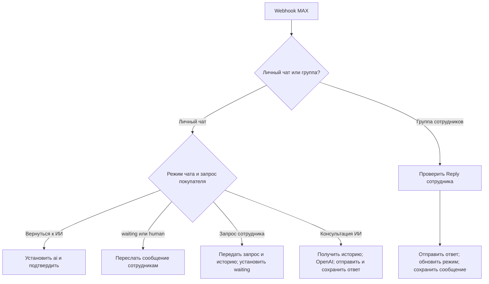
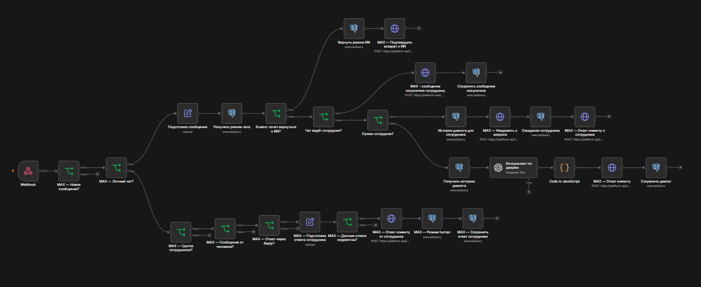

# Barrier MAX AI Assistant

[English version](README.md)

**Проект для реального заказчика — магазина дверей «Барьер» на Камчатке.**

ИИ-помощник для консультаций покупателей, построенный в n8n. Workflow принимает сообщения в MAX, подключает OpenAI с историей переписки из PostgreSQL и передаёт обращения сотрудникам. Сотрудники отвечают из рабочей группы, а покупатель получает их ответы в том же личном чате.

**Статус проекта:** основная функциональность реализована, проект подготовлен к тестированию заказчиком. Влияние на продажи и время работы сотрудников пока не измерено.

---

## Бизнес-задача

Покупатели спрашивают о выборе дверей, примерной стоимости, доставке, установке, замерах и визите в магазин. Сотрудники могут быть заняты или недоступны в момент обращения, а для подключения к разговору им нужен контекст.

Workflow отвечает на типовые вопросы по информации заказчика и передаёт сотруднику запрос с историей переписки. Наличие товара, окончательная цена и подтверждение даты выезда остаются за человеком.

---

## Моя роль

Собрал требования с заказчиком, настроил правила консультации, разработал workflow в n8n, подключил OpenAI и PostgreSQL, реализовал передачу диалога сотрудникам и адаптировал первоначальный Telegram-сценарий под MAX. Подготовил инструкцию сотрудникам и проверил основные сценарии до передачи заказчику на тестирование.

В репозитории опубликована версия MAX. Telegram был первым этапом разработки и в публичный экспорт не входит.

---

## Архитектура Workflow

Режимы чатов и история сообщений хранятся в PostgreSQL. Маршрутизация, передача сотруднику и проверка Reply выполняются условиями workflow, а не языковой моделью.

---

## Workflow

На скриншоте показаны основные ветки общения. Диагностические ноды и очистка тестового чата исключены из публичного workflow.

---

## Как это работает

1. MAX отправляет событие сообщения в webhook n8n с проверкой авторизации.
2. Workflow проверяет тип события и разделяет сообщения личного чата и группы сотрудников.
3. Для сообщения покупателя n8n подготавливает текст и ID чата, затем получает текущий режим из PostgreSQL.
4. В режиме ИИ загружаются до 30 предыдущих сообщений в хронологическом порядке. OpenAI отвечает с учётом истории и правил консультации магазина.
5. JavaScript нормализует ответ и добавляет сведения о магазине при соответствующем запросе на визит. n8n отправляет ответ и сохраняет пару сообщений user/assistant.
6. Запрос сотрудника, замера или согласования установки передаётся в рабочую группу; устанавливается режим `waiting`.
7. Сотрудникам передаются текущий запрос, ID чата покупателя и до 12 предыдущих сообщений; текст истории ограничен 2 500 символами.
8. В режимах `waiting` и `human` новые сообщения покупателя пересылаются в группу. ИИ на них не отвечает.
9. Сотрудник использует Reply на запрос или пересланное сообщение бота. После проверки ответ отправляется покупателю и сохраняется с пометкой сотрудника.
10. Покупатель возвращается к автоматической консультации фразой «Вернуться к ИИ».

---

## Режимы диалога

| Режим | Поведение |
| --- | --- |
| `ai` | ИИ консультирует покупателя; запрос помощи человека запускает передачу обращения. |
| `waiting` | Ожидание сотрудника; новые сообщения пересылаются в группу. |
| `human` | Диалог ведёт сотрудник через рабочую группу. |

Команда возврата к ИИ устанавливает `ai`. Поздний ответ сотрудника всё равно отправляется покупателю, а обновление режима сохраняет `ai`, если покупатель уже вернулся к помощнику. Эта проверка не гарантирует порядок обработки одновременных событий.

---

## Ключевые архитектурные решения

* OpenAI консультирует; маршрутизация и режимы управляются явными условиями.
* PostgreSQL хранит режим отдельно от контекста разговора с ИИ.
* Ключ сессии имеет формат `max:<chat_id>` и связывает сообщения с диалогом.
* Объём истории ограничивается перед передачей модели и сотрудникам.
* Ответ сотрудника должен прийти из настроенной группы, от человека и через Reply на сообщение, исходным автором которого является бот.
* ID чата покупателя и текст проверяются перед отправкой ответа.
* SQL-запросы используют параметры вместо подстановки пользовательского текста в строку запроса.
* Наличие, итоговую цену и запись подтверждает сотрудник. У ИИ нет доступа к текущим остаткам и полному каталогу 1С.

---

## Технологический стек

| Технология | Назначение |
| --- | --- |
| n8n | Автоматизация workflow, маршрутизация и интеграции |
| MAX HTTP API | Получение сообщений, ответы покупателю и работа с группой |
| OpenAI API | Консультация по правилам магазина с учётом переписки |
| PostgreSQL | История сообщений и постоянное хранение режимов |
| JavaScript | Нормализация ответа и логика выражений |
| Docker / Ubuntu VPS | Среда развёртывания |

---

## Импорт и настройка

Публичный экспорт не содержит credentials, внутренних ID группы и бота, закреплённой переписки и метаданных экземпляра n8n. Workflow не активирован и требует настройки.

1. Создайте тестовую базу и выполните `sql/schema.sql`. Это минимальная совместимая схема, восстановленная по запросам workflow, а не дамп рабочей базы.
2. Импортируйте `workflow/barrier-max.public.json` в n8n.
3. Настройте credentials MAX, авторизацию webhook, PostgreSQL и OpenAI.
4. Замените `STAFF_CHAT_ID` и `BOT_USER_ID` в нодах, перечисленных в [docs/setup.md](docs/setup.md).
5. Проверьте доступность модели, соединение с API и сведения магазина в системном промпте.
6. Настройте подписку MAX на свой HTTPS webhook с соответствующими параметрами авторизации.
7. Проверьте консультацию, передачу обращения, Reply сотрудника и возврат к ИИ перед активацией для покупателей.

Подробности настройки: [docs/setup.md](docs/setup.md). План ручной проверки: [docs/manual-checks.md](docs/manual-checks.md).

---

## Проверенные сценарии

Основные сценарии проверены в исходной настроенной среде до передачи заказчику:

* Консультация с учётом предыдущих сообщений.
* Запрос сотрудника и уведомление в рабочей группе.
* Пересылка новых сообщений при приостановленной консультации ИИ.
* Доставка Reply сотрудника в нужный личный чат.
* Возврат диалога в режим ИИ.
* Проверка ответов по ценам и условиям услуг, а также на посторонние запросы.

Очищенная копия прошла проверку JSON и целостности связей. Запуск с новыми credentials в отдельной среде не выполнялся.

---

## Границы текущей версии

* Текущие остатки, полный каталог и интеграция с 1С не подключены.
* Оплата, отслеживание заказов и автоматические напоминания не реализованы.
* В экспорте нет отдельной дедупликации событий, глобального workflow обработки ошибок или гарантированной очереди доставки. Повторные события, сбои и параллельные сообщения требуют доработки перед масштабированием.
* Цены и условия в промпте отражают дату экспорта и требуют актуализации перед повторным использованием.

---

## Автор

Александр Зайцев

AI Automation Engineer

* GitHub: https://github.com/AlexZaytsev-ai
* Email: [zaytcev_alexandr@mail.ru](mailto:zaytcev_alexandr@mail.ru)
